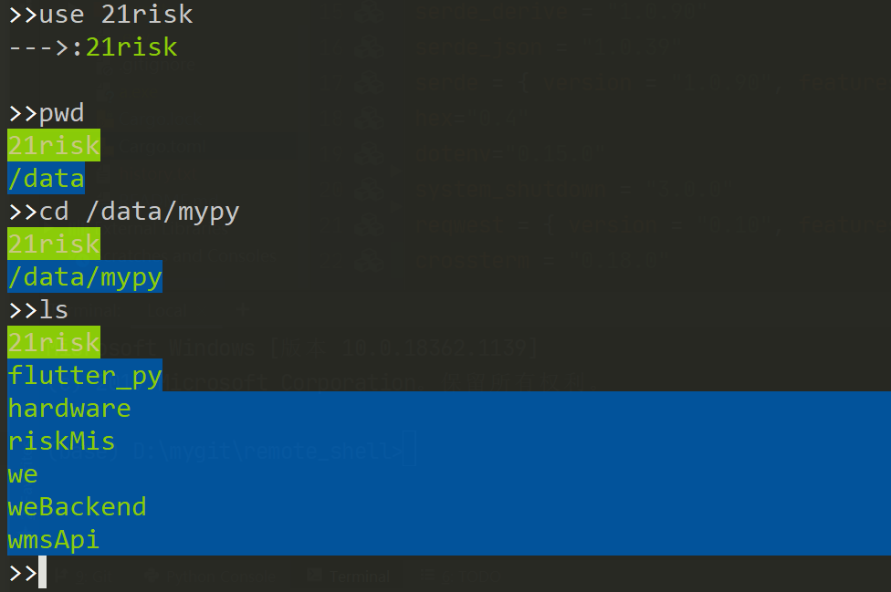

# remote_shell
Remote shell run through pass_ball  written by rust. The use scenarios include iot device with no fixed ip, home computer behind local network, etc. with remote shell client side installed on slave machine, you can access from remote_shell host side like normal ssh process.


## How to use:

### step 1: Start pass_ball message queue:

Git clone pass_ball(https://github.com/wangmarkqi/pass_ball) and run main.rs in server with public ip or any place accessible.  Revise  conf string in .env :
```
SLAVE_ID = yourid

PASS_URL = http://192.168.177.1:8084

```
SLAVEID is id for slave, the slave only response for request which specified by 'use' command. 

SLAVEID should not conflict with topics in pass msg queue,better use uuid as SLAVEID or any string you can sure will not duplicate.


### step 2: Start slave 
To use remote shell, 2 kinds of binary are needed to be build, the salve and the host. This step is for slave side. 
Git clone remote_shell in slave machine and run slave::slave_dispatch::dispatch() in main.rs;


### step 3: Start host 
This step  is for host side. 
Git clone remote_shell in host machine and run host::shell::run_shell()

### step 4: Stared with command "use"
 First specify slave id by "use <slave id which from step 2>" and send command as normal shell,like "cd /home" etc. 


## Terminal operation:
 You may find the common used key like del,arrow left,arrow right not working ,because remote_shell rewrite the terminal from raw mode. The shell operational keys include:

###  press key arrow up:
Back to last cmd input.

###  press key arrow down:
Go to next cmd input.

###  press key backspace:
Delete input char before.

###  press key Tab:
Complement input cmd based on history inputs.

###  press key Home:
Clear Terminal.

###  press key Esc:
Quit the shell.
## The buildin function: 
Besides standard commands,for example ls,pwd in linux or dir in win10, remote_shell provides building commands. 
### use <slave_id>
This command will specify the slave you want to control.You should run step3 on slave pc and config the slave id in the .env file. This salve_id (use arg) should be same with id in the .env file.

example: use remote

### send <local_file_path> <remote_file_path>
Send local file to remote. only small file works.

example: send C://test.txt /home/test.txt
### rec <local_file_path> <remote_file_path>
Receive file from remote. only small file works.

example: rec C://test1.txt /home/test2.txt

### restart
Will restart remote computer.This command is sent by async message pub channel and act as the final rescue when shell crash. Pay attention to restart remote_shell automatically after system reboot.

example: restart

